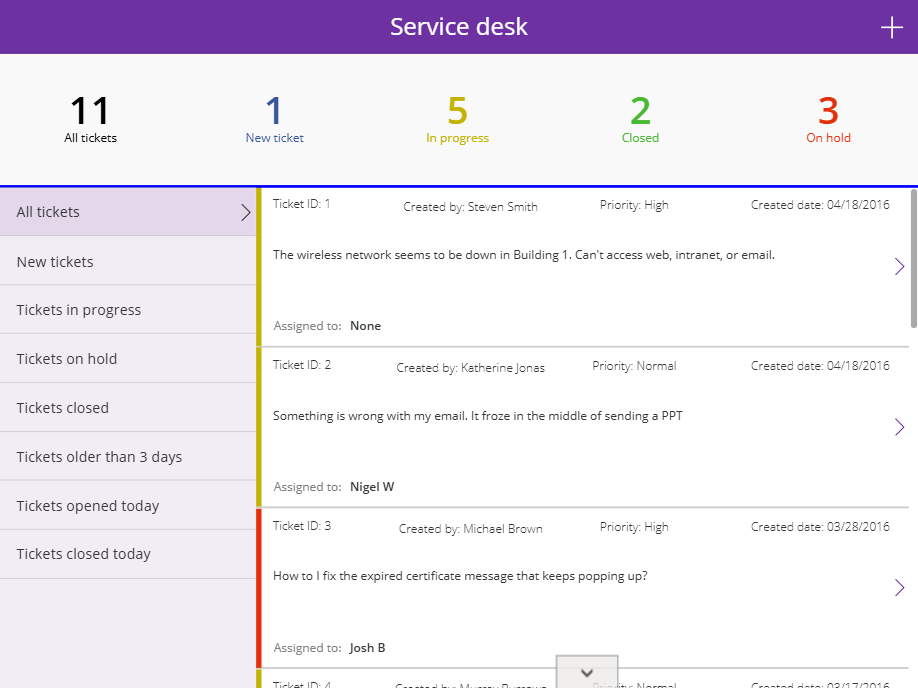

# Power-Apps-MS-ServiceDesk-Template

Hi guys!

If you're looking for GitHub, you can find it here: 
- https://github.com/PowerAppsDarren/Power-Apps-MS-ServiceDesk-Template

......here are some changes

- ButtonCanvas9:
    Control: Button
    Properties:
      X: =40
      Y: =40
      Text: ="Create Ticket"
- ButtonCanvas1_1:
    Control: Button
    Properties:
    DisplayMode: =DisplayMode.Edit
    X: =242
    Y: =40